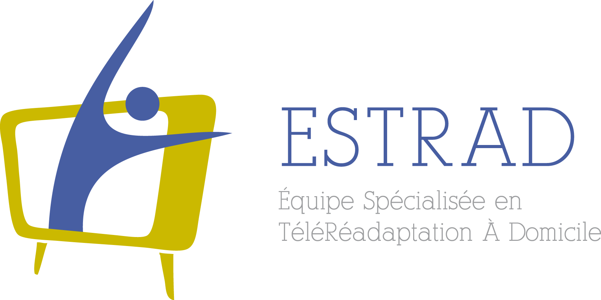

 

# OpenTera
We are developing an “Open Source” micro-services structure which will allow:
* Management of several sites, users, projects, participants, groups of participants, connected devices, sessions, data sources in a structured manner.
  * We developed a Qt management tool called [OpenTeraPlus](https://github.com/introlab/openteraplus), which is also under developement.
  * A web management interface will be developed in the future.
* Easy and secure deployment on any cloud, dedicated or embedded platform(such as a Raspberry Pi, AWS, Azure)
* Easy to use for elderly participants (no configuration, interfaces adapted to clients needs).
* Better collaboration / dissemination for open code.
* Support for several current and future research projects:
  * [INTER](https://regroupementinter.com/) - Tele-Actimetry: connected watches, portable capture devices. 
  * INTER - Tele-Rehabilitation: videoconference, management of rehabilitation sessions for participants using tele-rehabilitation. 
  * INTER - Active desk: Management of active desks and data visualization in the form of a dashboard. 
  * INTER - [OpenIMU](https://github.com/introlab/OpenIMU), [OpenIMU-MiniLogger](https://github.com/introlab/OpenIMU-MiniLogger): Capture, visualization and analysis of data from inertial measurement units.
  * [AGEWELL](https://agewell-nce.ca/) (SMART, [MOvIT+](https://github.com/introlab/MOvITPlus)): Tele-presence and assistance of elderly people at home by a mobile robot, and power wheelchairs instrumentation and usage monitoring. 

If there is a service that you would like to develop in the future and it would be a very interesting addition to the OpenTera platform. You are welcome to participate in this effort.

# Documentation and getting started
Detailled information is available in the [wiki](https://github.com/introlab/opentera/wiki)

Documentation is in progress... as most of the open-source projects! Feel free to write any issues if support is needed.

# News
* **(October 2020)**
First version released, v1.0 This version aims to support tele-rehabilitation video sessions and other related telehealth services. Work is in progress to complete the active desks service and projects (details to come - project not public yet). 

* **(April 2020)**. We made a prototype COVID-19 videoconference dispatch center using OpenTera. The idea is to have a system with a questionnaire that patients fill out online and shedule an appointment for a videoconference. Tt does not send emails at the moment and it gives a direct connection link instead for testing. The dispatch central takes calls in order of arrival with the aim of using remote resource persons (retired nurses from home for instance) who could help people navigate the health system better depending on the severity of the symptoms.
  * **WARNING - This was a prototype and has been removed from the current releases. **

# License
OpenTera is licensed under [Apache License 2.0](https://www.apache.org/licenses/LICENSE-2.0.txt) . 

# Related Projects
## General
* [OpenTeraPlus Desktop Application](https://github.com/introlab/openteraplus)
* [OpenTera WebPortal Service](https://github.com/introlab/opentera-webportal-service)

## Robots
* [WebRTC Native Libraries](https://github.com/introlab/webrtc-native-build)
* [OpenTera WebRTC Libraries](https://github.com/introlab/opentera-webrtc)
* [OpenTera WebRTC ROS Client and Nodes](https://github.com/introlab/opentera-webrtc-ros)
* [OpenTera Teleoperation Service](https://github.com/introlab/opentera-teleop-service)
* [OpenTera WebRTC Teleoperation Frontend] (opentera-webrtc-teleop-frontend)

# Dependencies
OpenTera is based or uses the following Open Source technologies :
* [Python 3.8+, PSFL (BSD like)](https://www.python.org)
* [Flask, BSD](http://flask.pocoo.org)
* [Redis, BSD](https://redislabs.com/why-redis/)
* [txredisapi, Apache License 2.0](https://github.com/fiorix/txredisapi) 
* [SQLAlchemy, MIT](https://www.sqlalchemy.org)
* [Twisted, MIT](https://twistedmatrix.com)
* [PostgreSQL,  PostgreSQL License(MIT/BSD like)](https://www.postgresql.org)
* [Node.js, Node license](https://nodejs.org/en/)

# Authors
* Dominic Létourneau, ing. M.Sc.A., IntRoLab, Université de Sherbrooke (@doumdi)
* Simon Brière, ing. M.Sc.A., CDRV, Université de Sherbrooke (@sbriere)

# Contributors
* Philippe Arsenault
* Cédric Godin
* Marc-Antoine Maheux
* Cynthia Vilanova

# Sponsors
<table style="width:100%">
  <tr>
    <td align="center">
        
        
        
    </td>
  </tr>
  <tr>
    <td align="center">
        
        
        
    </td>
  </tr>
</table>
