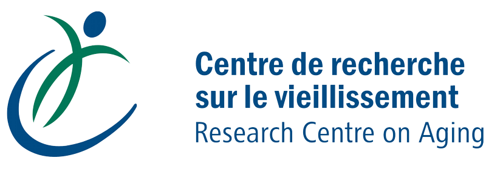

 

# OpenTera
We are developing an “Open Source” micro-services structure which will allow:
* Management of several sites, users, projects, participants, groups of participants, connected devices, sessions, data sources in a structured manner.
  * We developed a Qt management tooled called [OpenTeraPlus](https://github.com/introlab/openteraplus), which is also under developement.
  * A web management interface will be developed in the future.
* Easy and secure deployment on any cloud, dedicated or embedded platform(such as a Raspberry Pi, AWS, Azure)
* Easy to use for elderly participants (no configuration, interfaces adapted to clients needs).
* Better collaboration / dissemination for open code.
* Support for several current and future research projects:
  * [INTER](https://regroupementinter.com/) - Tele-Actimetry: connected watches, portable capture devices. 
  * INTER - Tele-Rehabilitation: videoconference, management of rehabilitation sessions for participants using tele-rehabilitation. 
  * INTER - Active Office: Management of active offices and data visualization in the form of a dashboard. 
  * INTER - [OpenIMU](https://github.com/introlab/OpenIMU), [OpenIMU-MiniLogger](https://github.com/introlab/OpenIMU-MiniLogger): Capture, visualization and analysis of data from inertial measurement units.
  * [AGEWELL](https://agewell-nce.ca/) (SMART, [MOvIT+](https://github.com/introlab/MOvITPlus)): Tele-presence and assistance of elderly people at home by a mobile robot, and power wheelchairs instrumentation and usage monitoring. 

We focused our first efforts on systems that transmit data on a daily basis (in batch) to archive data on our servers and allow the recovery of this data for offline analysis by researchers. We are currently working on the videoconference part for the tele-rehabilitation and robot's tele-operation sessions. The IOT development hasn't started yet. However, this is a service that we would like to develop in the future and it would be a very interesting addition to the OpenTera platform. You are welcome to participate in this effort.

# Visit us on GitHub
* https://github.com/introlab/opentera

# News
* **(April 2020)**. We made a prototype COVID-19 videoconference dispatch center using OpenTera. The idea is to have a system with a questionnaire that patients fill out online and shedule an appointment for a videoconference. Tt does not send emails at the moment and it gives a direct connection link instead for testing. The dispatch central takes calls in order of arrival with the aim of using remote resource persons (retired nurses from home for instance) who could help people navigate the health system better depending on the severity of the symptoms.
  * **WARNING - This is a prototype only, not for production and incomplete. Use at your own risks.**
  * You can use the [docker image](https://hub.docker.com/repository/docker/introlab3it/openteraserver) for quick tests. Make sure your local port is 40075. Certificates are auto-generated and self signed and you will get a security warning (that you can ignore) from the browser when navigating to the following urls:
    * Patient interface for registration : https://localhost:40075/videodispatch/
    * Simple dispatcher system for medical staff : https://localhost:40075/videodispatch/login. Use admin/admin for login and password.

# License
OpenTera is licensed under [Apache License 2.0](https://www.apache.org/licenses/LICENSE-2.0.txt) . 

# Dependencies
OpenTera is based or uses the following Open Source technologies :
* [Python 3.6+, PSFL (BSD like)](https://www.python.org)
* [Flask, BSD](http://flask.pocoo.org)
* [Redis, BSD](https://redislabs.com/why-redis/)
* [txredisapi, Apache License 2.0](https://github.com/fiorix/txredisapi) 
* [SQLAlchemy, MIT](https://www.sqlalchemy.org)
* [Twisted, MIT](https://twistedmatrix.com)
* [PostgreSQL,  PostgreSQL License(MIT/BSD like)](https://www.postgresql.org)
* [Node.js, Node license](https://nodejs.org/en/)

# Authors
* Dominic Létourneau, ing. M.Sc.A., IntRoLab, Université de Sherbrooke (@doumdi)
* Simon Brière, ing. M.Sc.A., CDRV, Université de Sherbrooke (@sbriere)

# Sponsors
<table style="width:100%">
  <tr>
    <td align="center">
        
        
        
    </td>
  </tr>
  <tr>
    <td align="center">
        
        
        
    </td>
  </tr>
</table>