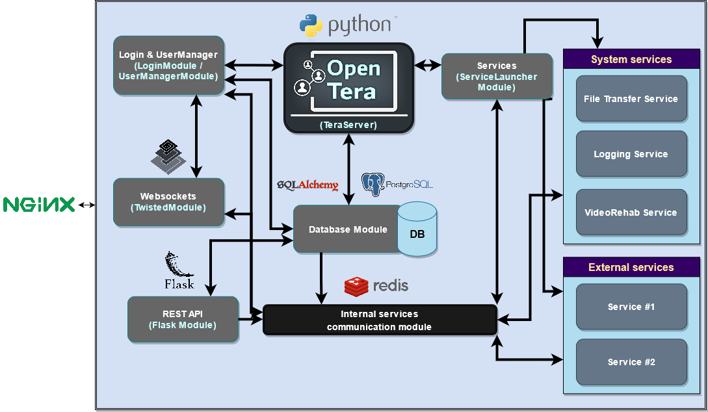

# OpenTera Architecture Overview

The following diagram presents the global OpenTera software architecture.

A modular architecture based on open-source projects and standards is used. Each of the component of that architecture is described below.

***

## Core module (OpenTera - TeraServer)
The core module is simply the manager of all the other components of the system. Internally, it is itself represented as a service, especially when it comes to [access and roles](services/teraserver/OpenTera_AccessRoles).

OpenTera server is fully written in Python, and the main script (TeraServer.py) basically starts and configure the components of the system based on the [configuration file](Configuration-files).

More information on this module can be found [here](services/teraserver/TeraServer-Service).

***

## Modules
Components that are used internally by the core module and do not need to be directly referenced or accessed by other services in the system are called modules. Each of the specific module has a defined role and can communicate with other modules or services in the system using the [internal services communication module](developers/Internal-services-communication-module).

### Login and UserManager module
As hinted by their names, those modules provides the required login validation check and keep a registry of currently logged-in users, participants and devices. See [Login and authentication](developers/Login-and-authentication) for further information on the available login types and sequence.

#### Login module
Simply put, this module provides authentication for the various main user types in the platform (users, participants, devices and services). It is in charge to generate temporary access token (if that mechanism is used) and invalidates them when they expire.

#### UserManager module
This module is a registry of user, participants and devices states (online, busy, status). By subscribing and publishing into various topics (see [Internal services communication module](developers/Internal-services-communication-module)), this module monitors topics generated by the [websockets](developers/Websockets-communication) to toggle states. It also support a remote process call interface (RPC) to query the various information in the registry.

More information on this module can be found [here](services/teraserver/UserManager-module).

### Websockets module
This module manages the websockets connection, from authentication to communication to and from each of them. It is based on the [Twisted engine](https://twistedmatrix.com/) and provides the required factories and event to properly handle websocket connections.

In the OpenTera platform, websockets are used in a one-way communication channel to send [messages](developers/Messages-structure) from the server to the clients. Client communication with the server uses the [Main OpenTera REST API](services/teraserver/api/API).

More information on this module can be found [here](developers/Websockets-communication).

### REST API module
This module, based on the [Flask web framework](https://flask.palletsprojects.com), provides the [Main OpenTera REST API](services/teraserver/api/API) that clients can use to request and update information from the server.

Various [authentication schemes](developers/Login-and-authentication) can be used to access restricted API calls. Depending on the [roles](services/teraserver/OpenTera_AccessRoles) of the requester, return values will either be filtered to include only accessible items or fully denied.

More information on this module and API can be found [here](services/teraserver/api/API).

### Database module
This module manages access to the various [database objects](developers/Database-Structure). When requesting information from the database, functions in that module ensure filtering of the returned values (or builds an appropriate query to filter directly in the database) so that the requester access levels are properly handled.

More information on the database structure can be found [here](developers/Database-Structure).

### Services module
This module wraps the services by setting up the basic [internal communication protocols](developers/Internal-services-communication-module) for each of the system services. It also launches those services.

This module can also automatically launch external services as stand-alone processes.

***

## System services
Those services are features that are shared by modules and external services. Each of them serves a specific purpose and will run in a separate process. Communication between modules and services will be done using the [Main OpenTera REST API](services/teraserver/api/API) and the [internal communication protocols - subscribe-publish](developers/Internal-services-communication-module).

### File transfer service
The file transfer service is a service that manages file transfers (upload and download) within OpenTera. It allows other services to upload files in a central repository. While specific services can also implements file storage and indexing, this service can be used to quickly reuse components.

More information on this service can be found [here](services/FileTransfer-Service).

### Logging service
The logging service acts as a central log repository. Using messages with the [internal communication protocols - subscribe-publish](developers/Internal-services-communication-module), every module and service interacting with OpenTera can log information in that service. More specifically, the service process the [LogEvent](developers/Messages-structure) message.

More information on this service can be found [here](services/Logging-Service).

### Videorehab service
As many external service might need a videoconferencing application, this service is included in the core OpenTera server. Based on [WebRTC](https://webrtc.org/), an adaptation for rehabilitation sessions is provided, providing an adapted user-interface for such usage. Implementation uses [Node.js](https://nodejs.org) and [Open-EasyRTC](https://github.com/open-easyrtc/open-easyrtc).

More information on this service can be found [here](services/Videorehab-Service).

***

## External services
OpenTera is built as an extensible system onto which various services to address specific needs can be added.

As of now, there's many such services in development, not all of them being public-ready. To name a few:
* [Robot teleoperation service](https://github.com/introlab/opentera-teleop-service), which aims to provide an integrated robot teleoperation system in OpenTera
* [Web portal](https://github.com/introlab/opentera-webportal-service), which aims to provide a customized portal for participants (with personalized shortcuts to other OpenTera services or external websites) and for users (to provide a web dashboard of a project).

***

## Clients
External communication between clients, whether they are web front-ends or compiled software, is done using [NGINX](https://www.nginx.com/) that acts as a router between every services, exposing only a single port, and acts as a central encryption and management of certificates.

More information on security and routing can be found [here](Security) and in each of the services and modules.
