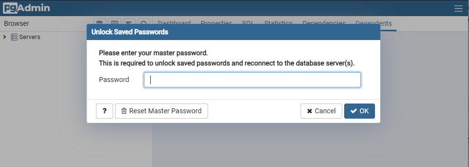
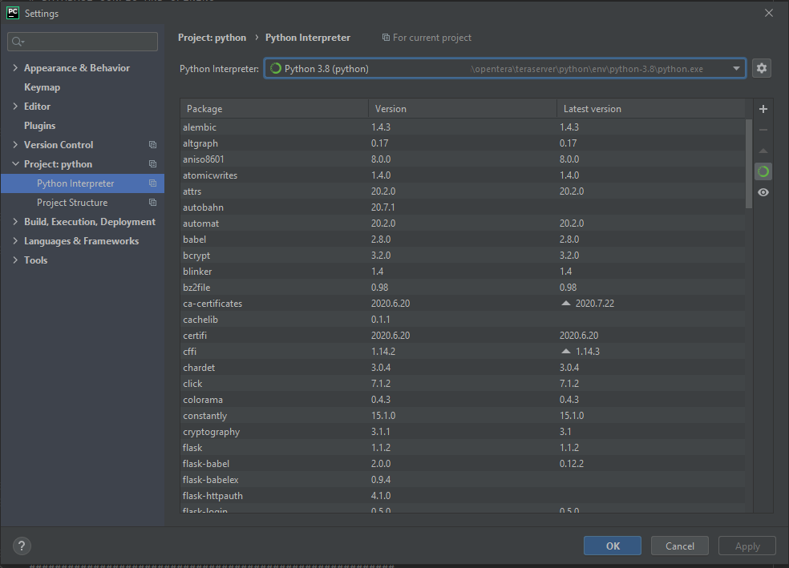

# Getting Started for Developers - Ubuntu-based Linux distros
## Pre-requisites
To get started on Linux, the following components are needed:
* [Git](https://git-scm.com) required to get the code.
* [CMake](https://cmake.org) required to build the python environment and [translations](Translations).
* [Miniconda 3](https://conda.io/miniconda.html) required to build the python environment
* [PostgreSQL](https://www.postgresql.org/download/) for the [database backend](Database-Structure)
* [Redis Server](https://github.com/tporadowski/redis/releases) for the [internal communication system](Internal-services-communication-module)
* [NGINX](https://nginx.org/en/download.html) for the system routing
* [Node.js](https://nodejs.org) required for the [VideoRehab service](../services/Videorehab-Service)
* (Optional) [Qt Creator](https://www.qt.io/download) for a UI to execute the `cmake` command
* (Optional) [PyCharm](https://www.jetbrains.com/pycharm/) for a development UI (very recommended, though you could, in theory, use any other IDE or text editor)

### Installing git, cmake and nodejs
Execute the following command (or install it using your favorite package manager):
```
sudo apt-get install git cmake nodejs
```

### Installing Miniconda
MiniConda isn't available in a Linux repository. You will need to [download the bash installer script](https://conda.io/en/latest/miniconda.html#linux-installers) and follow the [installation instructions](https://conda.io/projects/conda/en/latest/user-guide/install/linux.html#installing-on-linux).

### Installing PostgreSQL
Simply execute the following command (or install it using your favorite package manager):
```
sudo apt-get install postgresql
```
If you need to change the default password, it will also needs to be changed in the [configuration files]((Configuration-files).

### Installing Redis Server
Simply execute the following command (or install it using your favorite package manager):
```
sudo apt-get install redis-server
```

If you are setting a user and a password, you will need to adjust the [configuration files](../Configuration-files) accordingly.

### Installing (and running) NGINX
Simply execute the following command (or install it using your favorite package manager):
```
sudo apt-get install nginx
```
By default, nginx will be installed as a service. As such, you will have to properly configure it with the [NGINX config files](https://github.com/introlab/opentera/tree/main/teraserver/python/config) in the right path.

Alternatively, you could also disable the nginx service and run it manually when required with the shell script `start_nginx.sh` provided [here](https://github.com/introlab/opentera/tree/main/teraserver/python/config).

### Installing Qt Creator
While this step is optional, it could ease the environment building process.
When installing Qt, only the Qt Creator is needed for this project. You would, however, include CMake from there or a supported Qt environment if you're planning to also setup a development environment for [OpenTeraPlus](https://github.com/introlab/openteraplus)

## Environment setup

**1. Get the code!**

To get started with this project and develop, clone the project in a working directory.

If you need a stable branch, you should clone the `main` branch. Otherwise, it is recommended to start and clone the `dev` branch. If using a command line interface, the following command should be used, replacing the `<branch>` tag:

```
git clone --recursive -b <branch> https://github.com/introlab/opentera.git
```

**2. Generate the Python environment**

CMake is used to generate the python environment. While, in theory, you could create a virtual environment by yourself using the [`requirements`](https://github.com/introlab/opentera/blob/main/teraserver/python/env/requirements.txt) file, it is easier to simply use the cmake tool.

If you are using Qt Creator and that the CMake tool is properly set up, you should simply be able to `Run CMake` and then `Build` the project. Make sure that the target `python-all` is specified as the environment will not be properly generated otherwise.

On a command line interface, the following commands should be used (while in the `<base folder>/teraserver` directory):
```
cmake
cmake --build --target python-all
```

**3. Databases setup**

While the [database structure](Database-Structure) by itself will be auto-generated the first time OpenTera is run, the databases will need to have been created beforehand.
  1. Open the pgAdmin interface.
  2. Login to the database manager using the password specified at the installation

  3. On the left side, expand the "Servers" section. If required, enter the password again.

The pgAdmin interface will then be ready for the next steps.

### Creating users
A single user, `teraagent` with the default password `tera` will need to be created before creating the required databases. A different user and/or a different password could be used, but the [configuration files](../Configuration-files) will need to be adjusted accordingly.
  
  1. Right-click on the `Login/Group Roles` section in the left tree of the pgAdmin interface
  2. Select `Create...` and then `Login/Group Role...`
  3. Fill the following informations in the dialog:
     * `General` - `Name`: teraagent
     * `Definition` - `Password`: tera
     * `Privileges` - `Can login`: On
  4. Save the dialog

The `teraagent` user should have been created.

### Creating databases
Each system service will requires its own database. The default database that needs to be created are as follow:
* `opentera`, the [main OpenTera service](../services/teraserver/TeraServer-Service) database
* `openterafiles`, the database for the [file transfer](../services/FileTransfer-Service) service
* `openteralogs`, the database for the [logging service](../services/Logging-Service)

The steps to create a database are as follow. Those steps should be repeated for each database to create.
  1. In pgAdmin, under `Servers`, right-click on the correct server instance (for example `PostgreSQL 13`).
  2. Select `Create...` and `Database..."
  3.  Fill the following informations in the dialog:
     * `General` - `Database`: name of the database to create (see above)
     * `General` - `Owner`: teraagent
  4. Save the dialog

**4. Videorehab service setup**

That service requires a node.js environment to be set up. 
  1. In a command line console, `cd <base folder>/teraserver/easyrtc`
  2. Run the `npm install` command

The node.js environment should then be properly installed.

**5. PyCharm setup (if required)**

If using PyCharm, the correct Python interpreter and environment will need to be set up before being able to properly run the server.
  1. Open PyCharm, loading the project from `<base folder>/teraserver/python`
  2. In `Files -> Settings-> Project : python -> Python Interpreter`, click on the `Show all` option in the selection bar.
  3. In the `Virtualenv` tab, choose the existing environment. Change the interpreter to the following :
`...\teraserver\python\env\python-3.8\python.exe`  
The end result should look like this :  


**6. Self-signed certificates generation**
Self-signed certificates should be generated for the development server and to sign device certificates.

This can simply be done by running the `CreatesCertificates.py` script (directly in PyCharm if configured)

## Starting the main OpenTera service
If all the configuration was properly done, you should now be able to run the main script, `TeraServer.py`.

Don't forget to start the NGINX router beforehand and any other component that were not set to auto-run or as a Windows service.

If all went well, you should be able to see the `About` page in your browser: [https://localhost:40075/about](https://localhost:40075/about)
